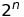
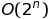
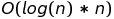

# Rucksack Problem

This is an entry for a code competition by <a href="https://www.it-talents.de/foerderung/code-competition/code-competition-05-2017">it-talents.de</a>. The task was to write some sort of implementation solving the <a href="https://en.wikipedia.org/wiki/Knapsack_problem">Rucksack Problem</a>.

A lot of algorithms have been found to solve this Problem by now. I decided to implement 3 different versions. A blunt Brutforce Algorithm, a Greedy Algorithm and a PTAS Algorithm, which can also be a FPTAS if the input is set acordingly. 

## Brut Force
With <i>n</i> objects that can be chosen to be put inside the rucksack there are </img>. To get every posible combination of objects an index can be iterated from 0 to </img>. In binary expression each bit of the number is mapped to an object. If it is <i>1</i> it is packed inside the rucksack, for <i>0</i> it will be left out. 
This algorithm will always return the correct result, but with a polonomyal complexity of </img>, the algorithm is not practicable for larger inputs sizes.  

## Greedy Algrithm
For each object a ratio of price/weight is created. Then the array of ratios is sorted from large to small. Starting with the objects of high value the objects are put into the rucksack until no more objects fit into the rucksack. The complexity of this algorithm is </img> (depending on the sorting algorithm used). This makes it very fast. The downside is, for an uperbound rucksackproblem where objects can not be cut down, this algorithm can get arbitrary bad results.  
Example: max input = 300kg, input items (price, weight) : [(1€, 1kg), (299€, 300kg)]  The greedy algorithm will put the first item into the rucksack as the ratio 1/1=1 is greater than 299/300=0.99. Thus the second object will not fit anymore and the algorithm far off the optimum.  

## PTAS (Polynomial-time approximation scheme)
These kind of algorithms must be 