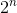
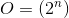
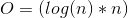
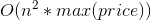
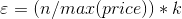
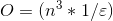
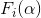
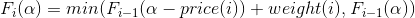
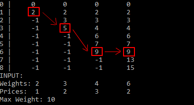

# Rucksack Problem

This is an entry for a code competition by <a href="https://www.it-talents.de/foerderung/code-competition/code-competition-05-2017">it-talents.de</a>. The task was to write some sort of implementation solving the <a href="https://en.wikipedia.org/wiki/Knapsack_problem">Rucksack Problem</a>.

A lot of algorithms have been found to solve this Problem by now. I decided to implement 3 different versions. A blunt Bruteforce Algorithm, a Greedy Algorithm, and a PTAS Algorithm, which can also be an FPTAS if the input is set accordingly.
 
## Brut Force
With <i>n</i> objects that can be chosen to be put inside the rucksack there are </img> different possible combinations of objects. To get every possible  combination of objects an index can be iterated from 0 to </img>. In binary expression each bit of the number is mapped to an object. If it is <i>1</i>, it is packed inside the rucksack, for <i>0</i> it will be left out. 
This algorithm will always return the correct result, but with a polynomial complexity of </img>, the algorithm is not practicable for larger inputs sizes.  

## Greedy Algorithm
For each object, a ratio of price/weight is created. Then the array of ratios is sorted from large to small. Starting with the objects of high value the objects are put into the rucksack until no more objects fit into the rucksack. The complexity of this algorithm is </img> (depending on the sorting algorithm used). This makes it very fast. As a downside, for an uper bound rucksack problem where objects can not be cut down, this algorithm can get arbitrary bad results.  
Example: max input = 300kg, input items: (1€, 1kg), (299€, 300kg)  The greedy algorithm will put the first item into the rucksack as the ratio 1/1=1 is greater than 299/300=0.99. Thus the second object will not fit anymore and the algorithm is far off the optimum.  

## PTAS (Polynomial-time approximation scheme)
A PTAS is a type of approximation algorithm for optimization problems. It is polynomial in n but not necessarily in its input length. For the implemented PTAS the complexity is </img>, which seems to be polynomial on first sight, but is not polynomial in its input length (max price). This is also called pseudo polynomial.  
The algorithm can be sped up by a factor of <i>k</i> with a resulting relative error of   </img>. If for a specific relative error the k is calculated and used, an FPTAS can be created which is also polynomial in its input with the complexity </img> 
<b>Implementation</b>: Iterate the price from 0 to the sum of all prices (maximum possible price). The goal is to find for each price </img>, the smallest possible weight </img> using the weights 1.. i. To achieve that, each </img> must be saved into a table for a later lookup of since </img>. 
For a very simple example with four items: (1€, 2kg), (2€, 3kg), (3€, 4kg), (2€, 6kg) and a maximum of 10kg, this is the resulting table:
</img>
The left column is the price </img> = 0.. 7€, the following 4 columns are </img> with i = 0.. 3. The table shows that the result is 6€ with 9kg since it reaches the highest price while being <= 10kg. 

## How to use the program
On program start, two parameters must be provided. 1.) the file name with the data for the specific Rucksackproblem. 2.) the speedup <i>k</i> for the PTAS algorithm. You can choose from the three existing files: test.txt, test_2.txt, greedy_bad.txt or create your own file. The format is like that:  
<i>Line 1: </i>MAX_WEIGHT 
<i>Line 2: </i>WEIGHT_1 WEIGHT_2 WEIGHT_3 
<i>Line 3: </i>PRICE_1 PRICE_2 PRICE_3 
e.g.: 
<i>Line 1: </i>10 
<i>Line 2: </i>3 5 7 
<i>Line 3: </i>2 1 4 
  
The file must be placed as a .txt file into the assets folder. (For the binary file there is a separate assets folder!). 
The speedup value is the factor <i>k</i>, that speeds up the PTAS algorithm in exchange for a relative error. For e.g. k = 5 the algorithm is 5x faster. 
As an output, the program shows the results for each algorithm. These results are:
- Weight Result: The sum of all weights of items the algorithm is choosing
- Price Result: The sum of all prices of items the algorithm is choosing
- Run Time (ms): How long did it take the algorithm to finish in milliseconds
- Run Steps: How many steps did the algorithm take. E.g. if O(n^3) and n = 2, it should be <i>around</i> 2^3 = 8 (in the big O notation some minor terms might be left out)
- Used Weights: shows the weights used for the calculated solution, where the number equals the weight value
- Relative Error: shows the relative error. e.g. 0.5 means that the result can be off up to 50% from the correct result.